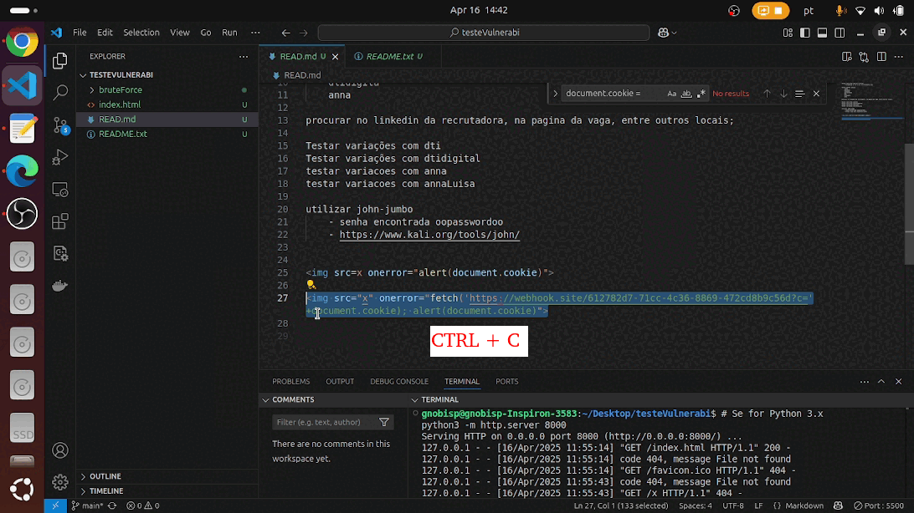

# 🔐 Desafio Técnico - dti digital

Projeto desenvolvido como parte do processo seletivo da **dti digital**.

---

## 🧩 Etapa 1 - Quebra de senha de arquivo `.zip`

A primeira fase do desafio consistia em descobrir a senha de um arquivo `.zip`, que continha o enunciado da segunda parte.

---

## 🚧 Estratégias Utilizadas

### 1. Força Bruta Simples (sem padrões)

#### 🛠 Ferramenta: `fcrackzip`

o fcraskzip permite escolher quais tipos e quantidade de digitos utilizados para quebrar o padrão. 

Comando usado:
```sh
fcrackzip -u -b -c 1aA! -l 4-4 arquivo_protegido.zip
```

- `1` → dígitos numéricos  
- `a` → letras minúsculas  
- `A` → letras maiúsculas  
- `!` → caracteres especiais  
- `-l 4-4` → senhas de exatamente 4 caracteres

A primeira tentativa foi realizar combinações simples entre letras maiusculas, minusculas, caracteres especias e numeros. Ou seja, o número 6 na linha "número" e na coluna "especial" significa que foi tentado gerar padrões de até 6 digitos utilizando combinações de números e caracteres especiais.

|                     | Número | Minúsculo | Maiúsculo | Especial |
|---------------------|:------:|:---------:|:---------:|:--------:|
| **Número**          |   8    |     5     |     5     |    6     |
| **Minúsculo**       |   5    |     6     |     5     |    5     |
| **Maiúsculo**       |   5    |     5     |     6     |    5     |
| **Especial**        |   6    |     5     |     5     |**-> 6**        |

Foram realizadas todas combinações possíveis dada a complexidade de tempo, como por exemplo, utilizando digitos númericos, caracteres especiais e letras minúsculas, porém não surtiu efeito.

> ❌ Tentativa falhou.

---

### 2. Força Bruta com Dicionário Personalizado

#### 🛠 Ferramenta: `fcrackzip` com dicionário

Para a segunda tentativa foram criados scripts em python(`/bruteForce`) para gerar combinações de senhas, e salvando as combinações em um arquivo `dicionario.txt`. Por exemplo, gerar senhas com o padrão `DTI`,`dti`, `dtiDigital`, `SENHA` ou `anna` (nome recrutadora).

Exemplos:
- `123DTI123`
- `abDTI123`
- `ooSENHAoo`

Comando usado:
```sh
fcrackzip -u -D -p dicionario.txt desafio.zip
```

> ❌ Tentativa falhou (mas poderia funcionar com o padrão correto).

---

### 3. Força Bruta com Dicionário Real

#### 🛠 Ferramenta: `john-jumbo`

Utilizado o dicionário `rockyou.txt`.

##### Passo 1: Gerar o hash
```sh
~/john-jumbo/run/zip2john /home/gnobisp/Desktop/desafio.zip > /home/gnobisp/Desktop/hash.txt
```

##### Passo 2: Rodar o ataque
```sh
john --format=zip /home/gnobisp/Desktop/hash.txt --wordlist=/usr/share/wordlists/rockyou.txt
```

> ✅ Senha descoberta com sucesso: **`oopasswordoo`**

---
## 🧩 Etapa 2 - Explorar vulnerabilidade da página
Na primeira fase do desafio obtivemos dois arquivos um `index.html` e um `readme.txt` que continha as instruções da segunda fase do desafio.

### O primeiro passou tomado foi iniciar o arquivo index.html em um servidor `http` local
```sh
python3 -m http.server 8000
```
Após isso utilizei a ferramenta de inspecionar para encontrar possíveis falhas.

### Encontrando as dicas
A primeira dica que encontrei foi a própria flag. A partir dela, identifiquei uma possível variável de interesse: document.cookie = "flag=XSS_FLAG_YOU_DID_IT";.
Ao inspecionar um pouco mais, percebi uma segunda pista, deixada devido ao desenvolvimento erroneo do código. O próprio desenvolvedor parecia estar ciente da falha, e por isso incluiu o seguinte filtro:
```sh
let sanitizedResult = result.toString().replace(/script|alert/gi, '');
```
Porém, a solução mal feita gerou uma dica valiosa de como explorar a página, deveriamos utilizar uma técnica chamada `xss vulnerability`, essa consiste de injetar scripts na página e coletar dados sensíveis.

### Explorando a falha
Primeiramente, tentei injetar um script simples como, por exemplo: 
```sh
<script>alert(document.cookie)</script>
```
Porém não surtiu efeito, por causa do filtro citado anteriormente.
Após isso, procurei comando que conseguiriam sair desse filtro, a solução encontrada foi passar o comando como uma imagem:
```sh

```
No comando acima, eu também coloquei para que o dado seja transmitido para um servidor de teste, para evidenciar a falha de segurança. Esse texto pode ser visto no gif abaixo:




## 🧩 Etapa 3 - Refatorar o código corrigindo a falha
Na segunda fase do desafio, encontramos a falha de segurança e exploramos ela. Para a etapa 3, devemos resolver essa falha de segurança. 

#### 1ª Solução Testada: Usar `<input type="number">`
O que foi feito:
Substituir os campos de:
```sh
<input type="text" id="num1" placeholder="Número 1">
```
para
```sh
<input type="number" id="num1" placeholder="Número 1" required>
```
A solução, inicialmente, se mostrou eficiente. O usuário fica impossibilitado de escrever texto, assim impossibilitando de enviar scripts. Porém o usuário pode alterar as regras do html assim modificando para que seja aceito texto novamente.

> ❌ Tentativa falhou.
#### 2ª Solução Testada: Usar `ewEntry.textContent = entry;`

A segunda solução encontrada foi substituir:
```sh
newEntry.innerHTML = entry;
```
por 
```sh
newEntry.textContent = entry;
```
Isso evita que scripts sejam rodados. No meu pensamento o problema do item anterior iria permanecer, ou seja, o usuário poderia alterar o código html para voltar para a  variavel.innerHTML. Porém, pelos testes realizados, foi resolvido.

> ✅ Falha resolvida.

document.cookie = "flag=XSS_FLAG_YOU_DID_IT; HttpOnly; Secure"; // Adicionar flags de segurança


